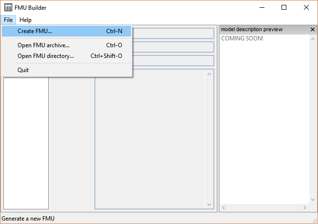
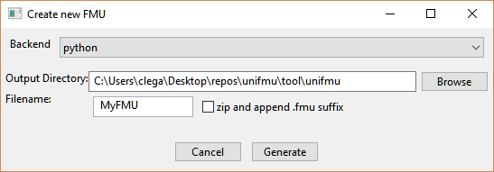
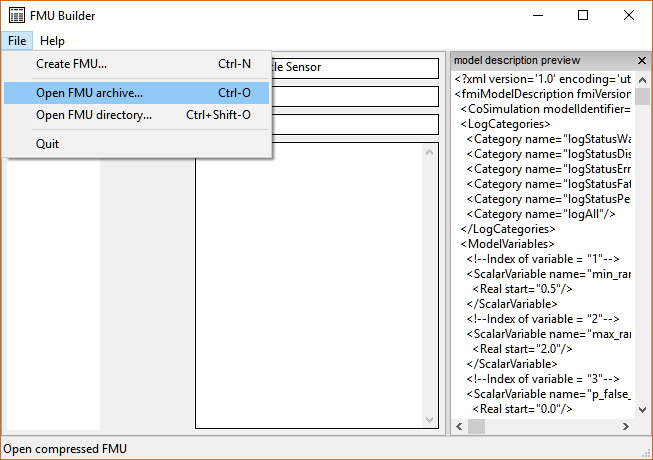
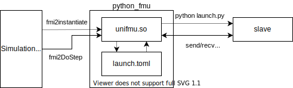

# Universal Functional Mock-Up Unit (UniFMU)

To successfully integrate FMI based co-simulation into a development process a model should be easy to create and modify.
In some cases a modelling tool may be available that provide the exact modelling capabilities needed.
However, there may be cases where existing tools are not suitable, or their cost prohibitive, in case of commercial tools.

In these cases it may be necessary to implement af FMU from scratch.
Correctly, implementing a FMU from scratch requires a deep technical knowledge og the FMI specification and the technologies it is built upon.
A consequence of FMI being a C-based standard is that a FMU must, generally, be implemented in C or a compiled language that offers binary-compatible with C such as C++, Rust, or Fortran.

UniFMU makes it possible to implement FMUs in any language, by writing a small a adapter for the particular language.
UniFMU also provides a GUI and CLI tool for generating new FMUs from a selection of languages, see backends.

A challenge of creating an FMU is defining its interface and which features of the FMI specification it supports.
Traditionally, this is done by manually editing a xml-file referred to as the model description; a process that is laden with pitfalls.

The GUI allows the FMU author to modify the underlying xml document is a more user-friendly manner and ensures that the xml file is consistent.

## How do i use the tool?

After the tool has been installed it can be accessed by typing `unifmu` in a shell.
To display the synopsis use the `--help` flag.

```bash
> unifmu --help
usage: unifmu [-h] {gui,generate} ...

Utility tool for creating and editing FMUs for FMI based co-simulation

positional arguments:
  {gui,generate}
    gui           open graphical user interface
    generate      create a new FMU using a specified language-backend

optional arguments:
  -h, --help      show this help message and exit
```

The command uses _git-style_ subcommands such as `generate` and `gui`.
Help for the individual commands can be inquired by appending the `--help` after the name of the subcommand.

#### Creating an FMU

The generate command can be used to create a new FMU:

```bash
unifmu generate python FMUS/python_fmu
```

The file structure of the generated FMU will look like the following:

```
python_fmu
├── binaries
│   ├── linux64
│   │   └── unifmu.so
│   └── win64
│       └── unifmu.dll
├── modelDescription.xml
└── resources
    ├── adder.py
    ├── fmi2.py
    ├── launch.py
    └── launch.toml
```

Alternatively, the same functionality can be accessed by launching the GUI

```bash
unifmu gui
```

<centering>

</centering>

And then using the `File->Create FMU` command:

<centering>

</centering>

### Modifying an existing FMU

The GUI makes it possible to edit an existing FMU.
Depending on whether the FMU is compressed or a directory use the `File->Open FMU archive` or `File->Open FMU directory` command.

<centering>

</centering>

## How does it work?

Recall, a fmu is an zip archive containing a static description of the models interface, `modelDescription.xml`, a set of platform shared object libraries defining the behavior of the model, and finally a set of option resource files that might be used during execution of the model.

To make this more concrete we consider the example of how python may be integrated using UniFMU, as shown in the _python_fmu_ example.
Below is the file structure of a concrete FMU:

```
python_fmu
├── binaries
│   ├── linux64
│   │   └── unifmu.so
│   └── win64
│       └── unifmu.dll
├── modelDescription.xml
└── resources
    ├── adder.py
    ├── fmi2.py
    ├── launch.py
    └── launch.toml
```

UniFMU provides a generic binary that can be dropped into any newly created FMUs by acting as a bridge between the FMI specification and interpreted languages.



The first thing that happens during simulation is the creation of instances of the particular FMU, each referred to as a slave.
UniFMU uses a simple configuration file `launch.toml`, located in the resources directory, to specify a command that is used to create new instances of the FMU.

__NOTE: Some backends require that the modelDescription.xml file has to be unzipped and available in the parent directory of the unzipped resources directory upon instantiation of an FMU Instance.__

Below is a configuration for starting a python based FMU, see `examples/python_fmu`:

```toml
[command]
windows = [ "python", "launch.py" ]
linux = [ "python3.8", "launch.py" ]
macos = ["python3.8","launch.py"]

[timeout]
launch = 500
command = 500
```

For this specific launch.toml file the UniFMU starts a new process by invoking the specified command, in this case:

```bash
python3.8 launch.py --handshake-endpoint "tcp://localhost:5000"
```

The process reads the launch.py file located in the resource folder.
The newly started script two sockets, a handshake socket used to establish the initial connection with the wrapper, and a command socket used by the wrapper to pass commands and results between the wrapper and the slave.

```python
# initializing message queue
context = zmq.Context()
handshake_socket = context.socket(zmq.PUSH)
command_socket = context.socket(zmq.REP)
handshake_socket.connect(f"{args.handshake_endpoint}")
command_port = command_socket.bind_to_random_port("tcp://127.0.0.1")
```

Following this the script awaits and executes commands sent to the slave:

```python
 # event loop
    while True:

        logger.info(f"slave waiting for command")

        kind, *args = command_socket.recv_pyobj()

        logger.info(f"received command of kind {kind} with args: {args}")

        if kind in command_to_slave_methods:
            result = command_to_slave_methods[kind](*args)
            logger.info(f"returning value: {result}")
            command_socket.send_pyobj(result)

        elif kind == 9:

            command_socket.send_pyobj(Fmi2Status.ok)
            sys.exit(0)
```

## How do I install it?

The easiest way to install the tool is using pip.
Clone the repository and invoke the following command the root:

```bash
pip install .
```

After installing verify the installation by inspecting the output from the following command:

```bash
unifmu --help
```

### Linux Additional Steps

You may need to install the following dependencies:

```
libgtk-3-dev
libsdl2-dev
```

For unix based platforms it is recommended to use the [prebuilt binaries](https://wxpython.org/pages/downloads/) to install wxpython. If the prebuilt binaries for wxpython are not used the installation of unifmu will take much longer.

Install wxpython for your distribution by invoking the following command, where the 'ubuntu-20.04'-part is replaced with your distro:

```bash
pip3 install -f https://extras.wxpython.org/wxPython4/extras/linux/gtk3/ubuntu-20.04 wxPython
```

## Building and Running Tests

Building and testing this project is described in [pythonapp.yml](.github/workflows/pythonapp.yml).
The following represents the easiest way to get started.

Building the project requires the following programs:

- python3
- cargo

A utility script, `build.py`, is located in the root of the repository.

To build and update the wrapper in the examples, use:
```bash
pip install setuptools
pip install .[protobuf-schema-generation,python-backend]
pip install --upgrade protobuf
python build.py --test-integration
```


## Backends

A backend is a piece of code that is responsible for communicating with the wrapper to execute commands on the proxy-fmu.
It does so by implementing an application-layer protocol called _unifmu-protocol_ which is built on top of [ZeroMQ](https://zeromq.org/).

Note that several backends for popular languages are provided by the tool out of the box.
These can be exported using the GUI or located manually inside the resources folder in the `tool/unifmu/resources`.

### Protocol

The goal of the unifmu-protocol is to allow the wrapper to execute commands on slave in a simple and language agnostic way.
This is done by implementing a request-response protocol where the wrapper sends a command consisting of an function id and a list of arguments for the specific method. 
When the slave receives the message, it extracts the id, calls the model's do_step method, and sends the result back to the wrapper.

The process is described by the pseudo code below, which shows the wrapper and the backend code:

**Wrapper**

```python
def fmi2Instantiate(...):
    # create sockets, execute launch command, and establish connection

def fmi2DoStep(current_time, step_size, ...):
    data = serialize(DO_STEP_ID, current_time, step_size, ...)
    status = send_and_get_response(data)
```

**Backend**

```python
# setup zeroMQ sockets and perform handshake with wrapper
while(true)

    command_id, args = wait_for_command()

    if command_id == DO_STEP_ID:
        status = do_step(args)
        respond_to_wrapper(status)
    ...

```

Since the FMI standard is based on calling through a binary C interface, many functions such as getters and setters only differ in their type (real, integer, boolean, and string).
To reduce the burden of implementing the backends, related functions are grouped together as shown in the figure below. To emphasize, only the methods indicated by the blue labels must be implemented by a backend.

Additionally, some FMI functions are not necessary to implement since they are implemented by the wrapper itself.
These functions are marked with a red lock icon in the figure below.


Each of the blue tags corresponds to a command that must be implemented by the backend.

| Function                       | Id  | Parameters                                                 | Return                          |
| ------------------------------ | --- | ---------------------------------------------------------- | ------------------------------- |
| set_debug_logging              | 0   | categories: list[str], logging_on: bool                    | status : int                    |
| setup_experiment               | 1   | start_time: float, tolerance: float?, stop_time: float?    | status: int                     |
| enter_initialization_mode      | 2   | None                                                       | status: int                     |
| exit_initialization_mode       | 3   | None                                                       | status: int                     |
| terminate                      | 4   | None                                                       | status: int                     |
| reset                          | 5   | None                                                       | status:int                      |
| set_xxx                        | 6   | references: list[int], values: list[float\|int\|bool\|str] | status:int                      |
| get_xxx                        | 7   | references: list[int]                                      | values: [float\|int\|bool\|str] |
| do_step                        | 8   | current : float, step_size : float, no_prior: bool         | status:int                      |
| serialize\*                    | 9   | None                                                       | state: bytes, status : int      |
| deserialize\*                  | 10  | data: bytes                                                | status: int                     |
| get_directional_derivative\*\* | 11  | TODO                                                       | TODO                            |
| set_input_derivatives          | 12  | TODO                                                       | TODO                            |
| get_output_derivatives         | 13  | TODO                                                       | TODO                            |
| do_step                        | 14  | TODO                                                       | TODO                            |
| cancel_step                    | 15  | TODO                                                       | TODO                            |
| get_xxx_status                 | 16  | TODO                                                       | TODO                            |

There are some exceptions, functions marked with asterisks in the table below are only required if the FMU using it sets
specific flags in their model description.

\*. required if "canGetAndSetFMUstate"

\*\*. required if "providesDirectionalDerivatives"

### The Specific Backends

#### Python

This backend allows an FMU to be implemented in Python 3.
When a new FMU is generated, it includes 3 Python scripts in the `resources` folder.

The role of the respective files are:

1. fmi2.py : Provides FMI specific base class that provides functionality commonly used for a FMU

2. adder.py : Concrete implementation of an FMU in Python

3. launch.py : Instantiates slave and implement communication with wrapper.

**How do i declare and access variables of the FMU?**

Variables defined in the model description are mapped directly to attributes with identical names on the python slave.

For example when the simulation tool sets the `real_a` declared in the `modelDescription.xml` file, this will result in the attribute `real_a` being set on the python slave:

```xml
<!--Index of variable = "1"-->
<ScalarVariable name="real_a" valueReference="0" variability="continuous" causality="input">
    <Real start="0.0" />
</ScalarVariable>
```

```python
class Adder(Fmi2FMU):
    def __init__(self):

        self.real_a = 0.0
        # other variables
```

Likewise, whenever an output, `real_b` is read by the simulation tool, the attribute `real_b` is read from the object.

Concretely, it is launch.py that does a translation from value refence to attribute name by reading the modelDescription.xml file and determining the mapping.
Subsequently, variables are read and written from the slave by invoking [getattr](https://docs.python.org/3/library/functions.html?highlight=setattr#setattr) and [setattr](https://docs.python.org/3/library/functions.html?highlight=getattr#getattr) methods of the slave object.

An effect of this is that properties work out of the box like they would in native python and that this logic is easy to extend. Properties are a great way to peform validation of inputs:

```python
# in adder.py
@property
def weight(self):
    return self.value

@weight.setter
def weight(self,value):
    if(value < 0):
        raise Exception("Weight must be greater than 0.0)
```

In addition to properties, python allows the programmer to overwrite the an objects setattr and getattr methods. For example, suppose that you want a number of inputs [x1,...,x10] to go into a single array inside the slave. In this case you could define a setattr method that recognices this particular set of inputs and writes them to an array in the slave object, rather than 10 individual attributes.

**How do I implement FMI methods?**

To implement a FMI specific method, take a look at the Fmi2FMU in fmi2.py, the parameters and return types are declared there.

```python
def do_step(
    self, current_time: float, step_size: float, no_step_prior: bool) -> int:
    # do some computation, set outputs, etc
    return Fmi2Status.ok
```

**How do I change the name of the slave?**

To change the name of the slave being instantiated you can modify the launch.py file to use the name of the class you want to instantiate:

```python
def get_slave_instance():
    return Adder()
```

**How do I test a slave?**

Remember your slave is valid python code, so not why test it in python, where you have good debugging tools.

A small test program can be written and placed in the file defining the slave as seen below:

```python
# definition of the FMU above ^^^^^

if __name__ == "__main__": # <--- ensures that test-code is not run if module is imported
    import numpy as np
    import matplotlib.pyplot as plt

    # create time stamps
    n_steps = 100
    ts, step_size = np.linspace(0, 10, n_steps, retstep=True)

    # create FMU
    generator = SineGenerator()
    generator.amplitude = 10
    generator.std = 1
    generator.setup_experiment(0)

    # outputs
    ys = np.zeros(n_steps)

    for idx, t in enumerate(ts):
        ys[idx] = generator.y
        generator.do_step(t, step_size, False)

    plt.plot(ts, ys)
    plt.ylabel("y(t)")
    plt.xlabel("t")
    plt.show()
```

A more complex FMU may warrant multiple test cases, each testing a distinct piece of functionality. For these cases a proper testing framework like [pytest](https://docs.pytest.org/en/stable/) is recommended.

**How can I modify the backend?**

While the three files: launch.py, fmi2.py, and adder.py, implement an object oriented method for implementing a FMU, it entirely possible to modify or even replace these files.

For example you could implement the FMU functions inside the launch.py, rather than in a separate file, or you could add logging calls to the definition of the Fmi2FMU class defined in the fmi2.py script.

As with any other backend the only requirement is that the running the launch command results in a connection being established between the wrapper and some process (this is what 'python launch.py' does). Inspecting the code of launch.py and comparing it with the unifmu protocol should hopefully clarify the interaction between the wrapper and the particular backend.

## Frequently Asked Questions

### How do execute the launch command though a shell?

The command specified in the launch.toml are executed without the use of a shell.
This means that functionality provided by the shell such as wildcards, per session environment variables, and aliases, are not evaluated.
Specifically, the process is launched using a popen-like api with shell=False, see [subprocess](https://docs.rs/subprocess/latest/subprocess/) for information on the differences.

There are several reasons for not launching directly through the shell by default. First, it may simply not be necessary if no functionality form the shell is needed.
In this case launching through the shell simply adds more complexity and reduces transparency.
Secondly, a system may have multiple shells and not all platforms have a consistent way to locate the shell.

If you want to invoke the launch command though the shell, you can specify the shell executable as the first argument as shown below:

```toml
# launch.toml
[command]
windows = [ "powershell.exe", "launch.ps1" ]
linux = [ "/bin/sh","launch.sh"]
macos = ["zsh","launch.sh"]
```

The example shows how a platform specific helper script would be invoked:

```bash
# launch.sh
python3.8 --version         # other steps, logging, etc.
EXPORT FOO=BAR              # set environment variable
python3.8 launch.py $1 $2   # last arguments are --handshake-endpoint and its value
```

### Do I need Python to run my FMU?

No, not in the general case. The FMUs generated by unifmu depend ONLY on the commands specified in the launch.toml file.
In the case of the _python_fmu_ example the command launches python, which is where the confusion may arise.

In addition to this the commandline tool is implemented itself is implemented in Python.
To summarize Python is required to use the tool that generates and packages the FMUs, but it is not required during their execution.

### How can I make my FMU portable?

Suppose that your FMU is written in python and that your launch.toml looks like:

```toml
# other targets
linux = [ "python3", "launch.py" ]
```

Using this command the wrapper try to use the system's python3 executable to launch the FMU by invoking executing the launch.py script.
Naturally, the success of this relies on python3 being in the systems path.

To make the FMU portable you could place a complete python interpreter inside resources folder of the FMU.
Then you can invoke the local interpreter rather than the system interpreter, by modifying the `launch.toml` file:

```toml
# other targets
linux = [ "./interpreter_linux/python3", "launch.py" ]
```

This approach is applicable to any OS and runtime dependency.
For Python getting a complete interpreter is a bit trickier, but tools for bundling interpreters and libraries exist such as [PyInstaller](https://pyinstaller.readthedocs.io/en/v4.1/index.html).

### Does an FMU need to support every feature of FMI?

No, the FMI2 specification allows you set falgs that declare the capabilities of an FMU.

For example, you may declare that the FMU supports serialization by setting `canGetAndSetFMUstate` and `canSerializeFMUstate` attributes in the modelDescription.xml, see specification p.25 for more info.
The simulation tool should check these flags during simulation and ensure that only supported operations are executed.

Naturally, the capabilities declared in the model description should also be implemented by the FMU.
The specifics of this depends on the particular backend being used.
For example, using the python backend implementing the capabilities `canGetAndSetFMUstate` and `canSerializeFMUstate` requires that the 2 following methods are defined:

```python
def serialize(self):

    bytes = pickle.dumps(
        (
            self.real_a
            # other attributes
        )
    )
    return bytes, Fmi2Status.ok

def deserialize(self, bytes) -> int:
    (
        real_a
        # other attributes
    ) = pickle.loads(bytes)
    self.real_a = real_a

    return Fmi2Status.ok
```

## Technical Design

### Wrapper

The wrapper is implemented in Rust. The source code can be in `wrapper/src` directory.

#### Serialization

### GUI

The GUI is implemented in python using the wxpython framework.
The source code for this can be found in the `tool/unifmu` directory.
