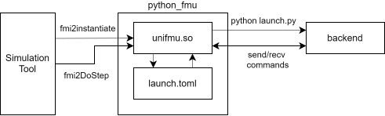

<!--  -->

# UniFMU - Universal Functional Mock-Up Units

- [UniFMU - Universal Functional Mock-Up Units](#unifmu---universal-functional-mock-up-units)
  - [Getting the tool](#getting-the-tool)
  - [Getting help](#getting-help)
  - [How to use the command line interface](#how-to-use-the-command-line-interface)
  - [Language specific documentation and backend development](#language-specific-documentation-and-backend-development)
  - [Supported Features](#supported-features)
    - [FMI2](#fmi2)
    - [FMI3 (in progress)](#fmi3-in-progress)
  - [Building and deployment](#building-and-deployment)
    - [Building during development](#building-during-development)
    - [Building for deployment](#building-for-deployment)
    - [Troubleshooting](#troubleshooting)
      - [Errors while running the docker build](#errors-while-running-the-docker-build)
  - [Frequently Asked Questions](#frequently-asked-questions)
    - [How can I execute the launch command through a shell?](#how-can-i-execute-the-launch-command-through-a-shell)
    - [Do I need Python to run my FMU?](#do-i-need-python-to-run-my-fmu)
    - [How can I make my FMU portable?](#how-can-i-make-my-fmu-portable)
    - [Does an FMU need to support every feature of FMI?](#does-an-fmu-need-to-support-every-feature-of-fmi)
    - [How does the FMU communicate with the backend?](#how-does-the-fmu-communicate-with-the-backend)
  - [Citing the tool](#citing-the-tool)


The [_Functional Mock-Up Interface_](https://fmi-standard.org/) _(FMI)_ defines an exchange format that allows models, referred to as _Functional Mock-Up Unit (FMU)_, to be shared between tools supporting the standard.
In general, an FMU must be implemented in a programming language that can produce binaries that can be called from C, such as C itself or C++.
While this allows efficient execution of a simulation, it is a significant limitation when prototyping models.

UniFMU is a command line tool that facilitates the implementation of FMUs in other popular languages that would otherwise not be able to produce C-compatible binaries.
It does this by providing a precompiled binary that is C-compatible, which then dispatches calls to the implementation of the model in the target language.

| Specification Version | FMU Interface   | Languages          | Binaries                   |
| --------------------- | --------------- | ------------------ | -------------------------- |
| FMI3 (_in progress_)  | (Co-Simulation) | (Python, C#, Java) | (win64, linux64, darwin64) |
| FMI2                  | Co-Simulation   | Python, C#, Java   | win64, linux64, darwin64   |
| FMI1                  | x               | x                  | x                          |

Examples of generated FMUs can be found in the [unifmu_examples](https://github.com/INTO-CPS-Association/unifmu_examples) repo.

## Getting the tool

The tool can be downloaded from [releases](https://github.com/INTO-CPS-Association/unifmu/releases) tab of the repository.
It is a single executable that bundles all assets used during FMU generation as part of the binary.

## Getting help

The current responsible for the tool maintenance is [Claudio Gomes](https://clagms.github.io/contact/). Feel free to reach out for help.

## How to use the command line interface

To display the synopsis use the `--help` flag.

```
unifmu 0.0.8

Implement Functional Mock-up units (FMUs) in various source languages.

* Source:   https://github.com/INTO-CPS-Association/unifmu
* Examples: https://github.com/INTO-CPS-Association/unifmu_examples

USAGE:
    unifmu <SUBCOMMAND>

OPTIONS:
    -h, --help       Print help information
    -V, --version    Print version information

SUBCOMMANDS:
    generate     Create a new FMU using the specified source language
    generate-distributed  Generates a pair of FMU/private folder for distributed co-simulation, where the FMU works as the proxy and the folder as the model
    help         Print this message or the help of the given subcommand(s)
```
The command uses _git-style_ subcommands.
Help for the individual commands can be inquired by appending the `--help` after the name of the subcommand.

Help for the command `generate`:
```
Create a new FMU using the specified source language

Usage: unifmu generate [OPTIONS] <LANGUAGE> <OUTPATH> [FMU_VERSION]

Arguments:
  <LANGUAGE>     Source language of the generated FMU [possible values: python, c-sharp, java]
  <OUTPATH>      Output directory or name of the FMU archive if "--zipped" is passed
  [FMU_VERSION]  Version of the FMI specification to target [default: fmi2] [possible values: fmi2, fmi3]

Options:
  -z, --zipped  Compress the generated FMU as a zip-archive and store with '.fmu' extension
  -h, --help    Print help
```

The `generate` command can be used to create a new FMU:

```bash
unifmu generate python model
```

The command generates a _placeholder FMU_ implemented in the specific language.
For example the tree below shows the placeholder FMU generated when implementing an FMU in python using UniFMU:

```python
📦model
 ┣ 📂binaries
 ┃ ┣ 📂darwin64
 ┃ ┃ ┗ 📜unifmu.dylib
 ┃ ┣ 📂linux64
 ┃ ┃ ┗ 📜unifmu.so
 ┃ ┗ 📂win64
 ┃ ┃ ┗ 📜unifmu.dll
 ┣ 📂resources
 ┃ ┣ 📂schemas
 ┃ ┃ ┗ 📜fmi2_messages_pb2.py
 ┃ ┣ 📜backend.py
 ┃ ┣ 📜launch.toml
 ┃ ┣ 📜model.py
 ┃ ┣ 📜README.md
 ┃ ┗ 📜requirements.txt
 ┗ 📜modelDescription.xml
```

Help for the command `generate-distributed`:
```
Generates a pair of FMU/private folder for distributed co-simulation, where the FMU works as the proxy and the folder as the model

Usage: unifmu generate-distributed [OPTIONS] <LANGUAGE> <OUTPATH> [FMU_VERSION]

Arguments:
  <LANGUAGE>     Source language of the generated FMU [possible values: python, c-sharp, java]
  <OUTPATH>      Output directory or name of the FMU archive if "--zipped" is passed
  [FMU_VERSION]  Version of the FMI specification to target [default: fmi2] [possible values: fmi2, fmi3]

Options:
  -e, --endpoint <ENDPOINT>  IP address of the host running the proxy FMU [default: 127.0.0.1]
  -z, --zipped               Compress the generated FMU as a zip-archive and store with '.fmu' extension
  -b, --black-box-fmu        Additional feature to handle when the private model is an existing black-box FMU with '.fmu' extension. In this case, the private backend always uses Python and its inner FMU requires to have the same name as the output directory or name of the FMU archive
  -h, --help                 Print help

```

The `generate-distributed` command can be used to create a new pair FMU (proxy) / folder (model) for distributed co-simulations (FMI2 only):
```bash
unifmu generate-distributed python model_distributed
```

The command generates a _placeholder FMU_ suffixed with _\_proxy_ and a _placeholder folder_ suffixed with _\_private_ in the specific language.
The proxy FMU differs from the FMU created with the `generate` command as it does not contain the model file and its dependencies.
For example the trees below show the placeholder FMU and folder generated when using the `generate-distributed` command with python as the language:
```
📦model_distributed_proxy
 ┣ 📂binaries
 ┣ 📂resources
 ┃ ┣ 📜launch.toml
 ┃ ┣ 📜README.md
 ┗ 📜modelDescription.xml
```

whereas its fellow private folder contains the model file, the dependencies, and the `endpoint.toml` file for the connection with the proxy FMU, as follows (**NOTE: This is not an FMU**):
```python
📦model_distributed_private
 ┣ 📂schemas
 ┃ ┗ 📜fmi2_messages_pb2.py
 ┣ 📜backend.py
 ┣ 📜model.py
 ┣ 📜launch.toml
 ┣ 📜endpoint.toml
 ┣ 📜README.md
 ┗ 📜requirements.txt
```

In order for the distributed co-simulation to work, the proxy FMU shall be executed first with a co-simulation master algorithm, and then, the private model shall be executed externally, using the IP address provided in `endpoint.toml` and the port opened by the proxy FMU as an argument (or after executing as a console input), for example (**NOTE: The port number is logged by the proxy FMU after initializing it**).
To change the default IP address, either run the command `generate-distributed` with the option `--endpoint=IP_ADDRESS` or update the `endpoint.toml` file directly.

In case the model in the private backend is an existing FMU, use the option `--black-box-fmu`. This will generate a private folder that interacts with the existing FMU using FMPy and UniFMU's existing capabilities. The FMU in the private folder should have the same name of the private folder without the suffix `_private`. In this example, the FMU should be called `model_distributed.fmu` and should be located in `path/to/model_distributed_private/`.

The private backend can be executed using the `launch.toml`, which defines the command to execute the model; in the case of python, it would look like (**Note:** `PORT_NUMBER` is an argument to pass directly the port to the process):

```
python path/to/model_distributed_private/backend.py PORT_NUMBER
```

## Language specific documentation and backend development

Like the file structure, the workflow for modifying FMUs varies depending on the implementation language.
Depending on the language a `README.md` is placed in the root of the generated FMU, which serves as documentation for the particular language.
The readme file, as well as other source files for each backend are in the respective folder:
- [Python](./assets/python/)
- [Csharp](./assets/csharp/)
- [Java](./assets/java/)
- [Matlab](./assets/matlab/) - This backend is not supported, but documentation is left in case you wish to implement it.

## Supported Features

### FMI2

| Name                              | Supported | Notes |
| --------------------------------- | --------- | ----- |
| fmi2GetTypesPlatform              | ✓         |       |
| fmi2GetVersion                    | ✓         |       |
| fmi2SetDebugLogging               | x         |       |
| fmi2Instantiate                   | ✓         |       |
| fmi2FreeInstance                  | ✓         |       |
| fmi2SetupExperiment               | ✓         |       |
| fmi2EnterInitializationMode       | ✓         |       |
| fmi2ExitInitializationMode        | ✓         |       |
| fmi2Terminate                     | ✓         |       |
| fmi2Reset                         | ✓         |       |
| fmi2GetReal                       | ✓         |       |
| fmi2GetInteger                    | ✓         |       |
| fmi2GetBoolean                    | ✓         |       |
| fmi2GetString                     | ✓         |       |
| fmi2SetReal                       | ✓         |       |
| fmi2SetInteger                    | ✓         |       |
| fmi2SetBoolean                    | ✓         |       |
| fmi2SetString                     | ✓         |       |
| fmi2GetFMUstate                   | ✓         |       |
| fmi2SetFMUstate                   | ✓         |       |
| fmi2FreeFMUstate                  | ✓         |       |
| fmi2SerializedFMUstateSize        | ✓         |       |
| fmi2SerializeFMUstate             | ✓         |       |
| fmi2DeSerializeFMUstate           | ✓         |       |
| fmi2GetDirectionalDerivative      | x         |       |
| fmi2EnterEventMode                | x         |       |
| fmi2NewDiscreteStates             | x         |       |
| fmi2EnterContinuousTimeMode       | x         |       |
| fmi2CompletedIntegratorStep       | x         |       |
| fmi2SetTime                       | x         |       |
| fmi2SetContinuousStates           | x         |       |
| fmi2GetDerivatives                | x         |       |
| fmi2GetEventIndicators            | x         |       |
| fmi2GetContinuousStates           | x         |       |
| fmi2GetNominalsOfContinuousStates | x         |       |
| fmi2SetRealInputDerivatives       | x         |       |
| fmi2GetRealOutputDerivatives      | x         |       |
| fmi2DoStep                        | ✓         |       |
| fmi2CancelStep                    | x         |       |
| fmi2GetStatus                     | x         |       |
| fmi2GetRealStatus                 | x         |       |
| fmi2GetIntegerStatus              | x         |       |
| fmi2GetBooleanStatus              | x         |       |
| fmi2GetStringStatus               | x         |       |


### FMI3 (in progress)

| Name                                | Supported | Notes |
| ----------------------------------- | --------- | ----- |
| fmi3GetVersion                      | ✓         |       |
| fmi3SetDebugLogging                 | x         |       |
| fmi3InstantiateModelExchange        | x         |       |
| fmi3InstantiateCoSimulation         | ✓         |       |
| fmi3InstantiateScheduledExecution   | x         |       |
| fmi3FreeInstance                    | ✓         |       |
| fmi3EnterInitializationMode         | ✓         |       |
| fmi3ExitInitializationMode          | ✓         |       |
| fmi3EnterEventMode                  | ✓         |       |
| fmi3Terminate                       | ✓         |       |
| fmi3Reset                           | ✓         |       |
| fmi3GetFloat32                      | ✓         |       |
| fmi3GetFloat64                      | ✓         |       |
| fmi3GetInt8                         | ✓         |       |
| fmi3GetUInt8                        | ✓         |       |
| fmi3GetInt16                        | ✓         |       |
| fmi3GetUInt16                       | ✓         |       |
| fmi3GetInt32                        | ✓         |       |
| fmi3GetUInt32                       | ✓         |       |
| fmi3GetInt64                        | ✓         |       |
| fmi3GetUInt64                       | ✓         |       |
| fmi3GetBoolean                      | ✓         |       |
| fmi3GetString                       | ✓         |       |
| fmi3GetBinary                       | ✓         |       |
| fmi3GetClock                        | ✓         |       |
| fmi3SetFloat32                      | ✓         |       |
| fmi3SetFloat64                      | ✓         |       |
| fmi3SetInt8                         | ✓         |       |
| fmi3SetUInt8                        | ✓         |       |
| fmi3SetInt16                        | ✓         |       |
| fmi3SetUInt16                       | ✓         |       |
| fmi3SetInt32                        | ✓         |       |
| fmi3SetUInt32                       | ✓         |       |
| fmi3SetInt64                        | ✓         |       |
| fmi3SetUInt64                       | ✓         |       |
| fmi3SetBoolean                      | ✓         |       |
| fmi3SetString                       | ✓         |       |
| fmi3SetBinary                       | ✓         |       |
| fmi3SetClock                        | ✓         |       |
| fmi3GetNumberOfVariableDependencies | x         |       |
| fmi3GetVariableDependencies         | x         |       |
| fmi3GetFMUState                     | ✓         |       |
| fmi3SetFMUState                     | ✓         |       |
| fmi3FreeFMUState                    | ✓         |       |
| fmi3SerializedFMUStateSize          | ✓         |       |
| fmi3SerializeFMUState               | ✓         |       |
| fmi3DeserializeFMUState             | ✓         |       |
| fmi3GetDirectionalDerivative        | x         |       |
| fmi3GetAdjointDerivative            | x         |       |
| fmi3EnterConfigurationMode          | ✓         |       |
| fmi3ExitConfigurationMode           | ✓         |       |
| fmi3GetIntervalDecimal              | ✓         |       |
| fmi3GetIntervalFraction             | ✓         |       |
| fmi3GetShiftDecimal                 | ✓         |       |
| fmi3GetShiftFraction                | ✓         |       |
| fmi3SetIntervalDecimal              | ✓         |       |
| fmi3SetIntervalFraction             | ✓         |       |
| fmi3SetShiftDecimal                 | ✓         |       |
| fmi3SetShiftFraction                | ✓         |       |
| fmi3EvaluateDiscreteStates          | x         |       |
| fmi3UpdateDiscreteStates            | ✓         |       |
| fmi3EnterContinuousTimeMode         | x         |       |
| fmi3CompletedIntegratorStep         | x         |       |
| fmi3SetTime                         | x         |       |
| fmi3SetContinuousStates             | x         |       |
| fmi3GetContinuousStateDerivatives   | x         |       |
| fmi3GetEventIndicators              | x         |       |
| fmi3GetContinuousStates             | x         |       |
| fmi3GetNominalsOfContinuousStates   | x         |       |
| fmi3GetNumberOfEventIndicators      | x         |       |
| fmi3GetNumberOfContinuousStates     | x         |       |
| fmi3EnterStepMode                   | ✓         |       |
| fmi3GetOutputDerivatives            | x         |       |
| fmi3DoStep                          | ✓         |       |
| fmi3ActivateModelPartition          | x         |       |

## Building and deployment


### Building during development

Building for local machine (with Windows as the example, and PowerShell commands for reference). This is a good method to locally test if the program is running as it should. A reference script is provided for some of the instructions below: [test_local.sh](test_local.sh)

1. Make sure you have the following installed on your computer:
   - a [C-compiler and linker](https://visualstudio.microsoft.com/vs/features/cplusplus/)
   - [rust](https://www.rust-lang.org/tools/install)
   - [Protocol Buffers v27.3](https://github.com/protocolbuffers/protobuf/releases/tag/v27.3). **Note: If you download a different version, you will have to update the build scripts and the dependencies of all backends.**.  **For Linux users:** be sure to have the *bin* folder of protobuf in your path, e.g., `export PATH=/path/to/protobuf/protoc-27.3-linux-x86_64/bin/:$PATH`
   
.
   - For testing:
     - [Python](https://www.python.org/) (no older than **version 3.8**) along with the packages [pyzmq](https://pypi.org/project/pyzmq/), [FMPy](https://pypi.org/project/FMPy/) and [protobuf 5.27.3](https://pypi.org/project/protobuf/5.27.3/). The packages [colorama](https://pypi.org/project/colorama/), [coloredlogs](https://pypi.org/project/coloredlogs/), and [toml](https://pypi.org/project/toml/) are also required for distributed FMUs.
     - [Java](https://openjdk.org/) (no higher than **version 17**) that's compatible with [VDMCheck](https://github.com/INTO-CPS-Association/FMI-VDM-Model) to test the generated FMU.
     - [.NET SDK (for C#)](https://dotnet.microsoft.com/en-us/download).

2. Clone the `unifmu` repository.

3. Make the changes you want.

4. Install the rust toolchain for your operating systems, e.g. `rustup target add x86_64-pc-windows-msvc` (msvc is the microsoft C-compiler).  **For Linux users:** run the command `rustup toolchain list` to identify the toolchain for your architecture and modify the command with the corresponding result, e.g., `rustup target add x86_64-unknown-linux-gnu`.

5. **Windows:** Build the FMU dll using `cargo build --target x86_64-pc-windows-msvc --release`. This should build the project for your operating system, and generate the `fmiapi.dll` in the folder [target/x86_64-pc-windows-msvc/release](target/x86_64-pc-windows-msvc/release/). The dll contains the FMU headers' implementation. **Linux:** Build the FMU `so` using the toolchain of your machine, e.g., `cargo build --target x86_64-unknown-linux-gnu --release`. This generates the `libfmiapi.so` in the folder [target/x86_64-unknown-linux-gnu/release](target/x86_64-unknown-linux-gnu/release/), which contains the FMU headers' implementation.

6. Generate the content for the [./assets/auto_generated/](./assets/auto_generated/) folder, that the CLI is packaged with.
   1. **Windows:** Copy the generated dll into the assets folder (needed by the CLI). **Note the change of filename.**
      ```powershell
      Copy-Item -Force ./target/x86_64-pc-windows-msvc/release/fmiapi.dll ./assets/auto_generated/unifmu.dll
      ```  
      **Linux:** Copy the generated `so` into the assets folder (**Note the change of filename**).
      ```
      cp target/x86_64-unknown-linux-gnu/release/libfmiapi.so assets/auto_generated/unifmu.so
      ```
   2. Generate the protobuf schemas for python, csharp, and java backends:
      ```powershell
      protoc -I=schemas --python_out=assets/auto_generated --csharp_out=assets/auto_generated --java_out=assets/auto_generated fmi2_messages.proto fmi3_messages.proto unifmu_handshake.proto
      ```
7. Run the integration tests: `cargo test`
   1. If the tests fail, it may be because you do not have the runtime dependencies for each backend, as they are all tested. Install any runtime dependencies needed for each backend. Check the readme files in each backend. See the  [Language specific documentation and backend development](#language-specific-documentation-and-backend-development) section for more information.

8. Compile the CLI and generate an FMU called `myfmu.fmu` using the newly compiled CLI:
    ```powershell
    cargo run --bin unifmu --release -- generate --zipped python myfmu.fmu fmi2
    ```

9.  To test the FMU, we recommend:
   1. Installing [FMPy](https://github.com/CATIA-Systems/FMPy), and use it to simulate the FMU:
      ```powershell
      pip install fmpy[complete]
      fmpy --validate simulate myfmu.fmu --show-plot
      ```
    2. Use [VDMCheck](https://github.com/INTO-CPS-Association/FMI-VDM-Model) tool to validate the FMU:
        ```powershell
        java -jar ./test_dependencies/vdmcheck-1.1.3/vdmcheck2.jar myfmu.fmu
        ```
        If the FMU exported implements FMI 3.0, then use `vdmcheck3.jar`

### Building for deployment

This method should be followed when building the tool to be deployed for different OSs (windows, macos, linux). The cross compilation happens via Docker and the script can be read in [docker-build/build_all.sh](docker-build/build_all.sh)

1. You need to have gone through the steps in the previous instructions for the development build.

2. Have [docker](https://docs.docker.com/engine/install/) installed on your computer.

3. Build the docker image using `docker build -t unifmu-docker docker-build`. `unifmu-docker` is the name of the container, and `docker-build` is the directory where the Dockerfile is (assuming you are running this command from the root of the unifmu repository).

4. Build the unifmu project in docker using the following command:
    ```powershell
    docker run --name builder -it --rm -v <location_of_unifmu_repository_on_local_pc>:/workdir unifmu-docker ./docker-build/build_all.sh
    ```
    where `<location_of_unifmu_repository_on_local_pc>` should be replaced by the path of the unifmu repository location.
    For example:
    ```powershell
    docker run --name builder -it --rm -v .:/workdir unifmu-docker ./docker-build/build_all.sh
    ```
    This should generate three folders in the `target` directory on your local computer, one folder for each OS (windows, macos, linux).

    **Note: On windows, git may be configured to replace LF line-endings with CRLF, which are not compatible with bash.**

### Troubleshooting

#### Errors while running the docker build

It's useful to open a terminal in the container and debug your way around:
```powershell
docker run --name builder -it --rm -v .:/workdir unifmu-docker bash
```

## Frequently Asked Questions

### How can I execute the launch command through a shell?

The command specified in the launch.toml are executed without the use of a shell.
This means that functionality provided by the shell such as wildcards, per session environment variables, and aliases, are not evaluated.
Specifically, the process is launched using a popen-like api with shell=False, see [subprocess](https://docs.rs/subprocess/latest/subprocess/) for information on the differences.

There are several reasons for not launching directly through the shell by default. First, it may simply not be necessary if no functionality form the shell is needed.
In this case launching through the shell simply adds more complexity and reduces transparency.
Secondly, a system may have multiple shells and not all platforms have a consistent way to locate the shell.

If you want to invoke the launch command though the shell, you can specify the shell executable as the first argument as shown below:

```toml
# launch.toml
[command]
windows = [ "powershell.exe", "launch.ps1" ]
linux = [ "/bin/sh","launch.sh"]
macos = ["zsh","launch.sh"]
```

The example shows how a platform specific helper script would be invoked:

```bash
# launch.sh
python3.8 --version         # other steps, logging, etc.
EXPORT FOO=BAR              # set environment variable
python3.8 launch.py $1 $2   # last arguments are --handshake-endpoint and its value
```

### Do I need Python to run my FMU?

No, not in the general case. The FMUs generated by unifmu depend ONLY on the commands specified in the launch.toml file.
In the case of an FMU generate for the python language, the command launches python, which is where the confusion may arise.

The command line interface of unifmu is implemented itself is implemented in Python.
To summarize Python is required to use the tool that generates and packages the FMUs, but it is not required during their execution (unless it's the python fmu that's been generated)

### How can I make my FMU portable?

Suppose that your FMU is written in python and that your launch.toml looks like:

```toml
# other targets
linux = [ "python3", "launch.py" ]
```

Using this command the wrapper try to use the system's python3 executable to launch the FMU by invoking executing the launch.py script.
Naturally, the success of this relies on python3 being in the systems path.

To make the FMU portable you could place a complete python interpreter inside resources folder of the FMU.
Then you can invoke the local interpreter rather than the system interpreter, by modifying the `launch.toml` file:

```toml
# other targets
linux = [ "./interpreter_linux/python3", "launch.py" ]
```

This approach is applicable to any OS and runtime dependency.
For Python getting a complete interpreter is a bit trickier, but tools for bundling interpreters and libraries exist such as [PyInstaller](https://pyinstaller.readthedocs.io/en/v4.1/index.html).

We did not decide to package all backends into the FMU because it would be impossible to predict the dependencies required by an fully implemented FMU. It's application specific.

### Does an FMU need to support every feature of FMI?

No, both the FMI2 and FMI3 specifications allow you set flags that declare the capabilities of an FMU.

For example, you may declare that the FMU supports serialization by setting `canGetAndSetFMUstate` and `canSerializeFMUstate` attributes in the modelDescription.xml. See the respective specifications for more information.

The simulation tool should check these flags during simulation and ensure that only supported operations are executed.

Naturally, the capabilities declared in the model description should also be implemented by the FMU.

The specifics of this depends on the particular backend being used.

For example, using the python backend implementing the capabilities `canGetAndSetFMUstate` and `canSerializeFMUstate` requires that the 2 following methods are defined:

```python
def serialize(self):

    bytes = pickle.dumps(
        (
            self.real_a
            # other attributes
        )
    )
    return bytes, Fmi2Status.ok

def deserialize(self, bytes) -> int:
    (
        real_a
        # other attributes
    ) = pickle.loads(bytes)
    self.real_a = real_a

    return Fmi2Status.ok
```

### How does the FMU communicate with the backend?

There are two primary means of communication:
1. Environment variables. UniFMU defines the following variables in the process created during the startup of the backend.
These can be accessed during execution by the model implementation or the backend.

    | Variable                        | Description                                                                                                                   | Example                               |
    | ------------------------------- | ----------------------------------------------------------------------------------------------------------------------------- | ------------------------------------- |
    | UNIFMU_GUID                     | The global unique identifier, passed as an argument to fmi2Instantiate                                                        | 77236337-210e-4e9c-8f2c-c1a0677db21b  |
    | UNIFMU_INSTANCE_NAME            | Name of the slave instance, passed as an argument to fmi2Instantiate                                                          | left_wheel_motor                      |
    | UNIFMU_VISIBLE                  | Flag used to indicating if the instance should run in visible mode, passed as an argument to fmi2Instantiate                  | {true, false}                         |
    | UNIFMU_LOGGING_ON               | Flag used to indicating if the instance should run with logging, passed as an argument to fmi2Instantiate                     | {true, false}                         |
    | UNIFMU_FMU_TYPE                 | Flag used to indicating if the instance is running in co-sim or model exchange mode, passed as an argument to fmi2Instantiate | {fmi2ModelExchange, fmi2CoSimulation} |
    | UNIFMU_DISPATCHER_ENDPOINT      | Endpoint bound by the zmq socket of the binary                                                                                | tcp://127.0.0.1/5000                  |
    | UNIFMU_DISPATCHER_ENDPOINT_PORT | Port component of UNIFMU_DISPATCHER_ENDPOINT                                                                                  | 5000                                  |
2. A socket is opened between the backend and the fmu. FMU calls are transformed into messages sent to the backend via that socket.
    The following diagram illustrates this:

    

3. For distributed FMUs, the proxy and the private processes run on two different network nodes and the communication between them is carried out with ZeroMQ. The proxy starts a broker-kind connection with ZeroMQ expecting to receive a connection from the private backend. That connection is initiated using the IP address stored in `endpoint.toml` and the port logged by the proxy FMU. Every time there is an FMI call in the proxy FMU, this is propagated to the private backend with ZMQ messages, which is then processed by the model. In case the `--black-box-fmu` option is passed, the private backend uses FMPy to communicate with the existing FMU.
The following diagram illustrates this:


## Citing the tool

When citing the tool, please cite the following paper:

- Legaard, C. M., Tola, D., Schranz, T., Macedo, H. D., & Larsen, P. G. (2021). A Universal Mechanism for Implementing Functional Mock-up Units. In G. Wagner, F. Werner, T. I. Ören, & F. D. Rango (Eds.), Proceedings of the 11th International Conference on Simulation and Modeling Methodologies, Technologies and Applications, SIMULTECH 2021, Online Streaming, July 7-9, 2021 (pp. 121-129). SCITEPRESS Digital Library. https://doi.org/10.5220/0010577601210129

Bibtex:

```
@inproceedings{Legaard2021,
  title = {A Universal Mechanism for Implementing Functional Mock-up Units},
  booktitle = {11th {{International}} Conference on Simulation and Modeling Methodologies, Technologies and Applications},
  author = {Legaard, Christian M. and Tola, Daniella and Schranz, Thomas and Macedo, Hugo Daniel and Larsen, Peter Gorm},
  year = {2021},
  pages = {121--129},
  address = {{Virtual Event}},
  series = {{{SIMULTECH}} 2021}
}
```
