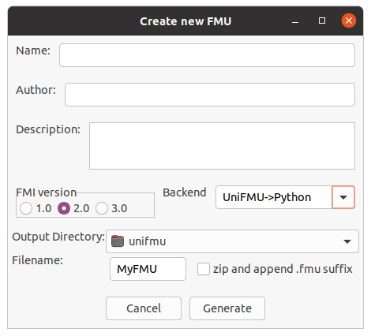

# Universal Functional Mock-Up Unit (UniFMU)

A challenge of integrating FMI based co-simulation into a development process is that available modelling tools may not cover a modelling need.
In these cases it may be necessary to implement af FMU from scratch.
Unfortunately, this is a challenging task which requires a understanding of FMI inner workings.

UniFMU makes it possible to implement FMUs in any language, by writing a small a adapter for the particular language. UniFMU also contains a provides a GUI and CLI tool for generating new FMUs from a selection of languages, see adapters. 

<centering>

</centering>

## How does it work?

Recall, a fmu is an zip archive containing a static description of the models interface, `modelDescription.xml`, a set of platform shared object libraries defining the behavior of the model, and finally a set of option resource files that might be used during execution of the model.

To make this more concrete we consider the example of how python may be integrated using UniFMU, as shown in the *python_fmu* example.
Below is the file structure of a the concrete FMU:
```
python_fmu
├── binaries
│   ├── linux64
│   │   └── unifmu.so
│   └── win64
│       └── unifmu.dll
├── modelDescription.xml
└── resources
    ├── adder.py
    ├── fmi2.py
    ├── launch.py
    └── launch.toml
```

UniFMU provides a generic binary that can be dropped into any newly created FMUs by acting as a bridge between the FMI specification and interpreted languages.


The first thing that happens during simulation is the creation of instances of the particular FMU, each referred to as a slave. 
UniFMU uses a simple configuration file `launch.toml`, located in the resources directory, to specify a command that is used to create new instances of the FMU.

Below is a configuration for starting a python based FMU, see `examples/python_fmu`:

``` toml
[command]
windows = [ "python", "launch.py" ]
linux = [ "python3.8", "launch.py" ]
macos = ["python3.8","launch.py"]

[timeout]
launch = 500
command = 500
```

For this specific launch.toml file the UniFMU starts a new process by invoking the specified command, in this case:
``` bash
python3.8 launch.py --handshake-endpoint "tcp://localhost:5000"
```

The  process reads the launch.py file located in the resource folder.
The newly started script two sockets, a handshake socket used to establish the initial connection with the wrapper, and a command socket used by the wrapper to pass commands and results between the wrapper and the slave.

``` python
# initializing message queue
context = zmq.Context()
handshake_socket = context.socket(zmq.PUSH)
command_socket = context.socket(zmq.REP)
handshake_socket.connect(f"{args.handshake_endpoint}")
command_port = command_socket.bind_to_random_port("tcp://127.0.0.1")
```

Following this the script awaits and executes commands sent to the slave:
``` python
 # event loop
    while True:

        logger.info(f"slave waiting for command")

        kind, *args = command_socket.recv_pyobj()

        logger.info(f"received command of kind {kind} with args: {args}")

        if kind in command_to_slave_methods:
            result = command_to_slave_methods[kind](*args)
            logger.info(f"returning value: {result}")
            command_socket.send_pyobj(result)

        elif kind == 9:

            command_socket.send_pyobj(Fmi2Status.ok)
            sys.exit(0)
```


## How do i install it?

The easiest way to install the tool is using pip.

``` bash
pip install unifmu
```

After installing verify the installation by inspecting the output from the following command:
``` bash
unifmu --help
```

### Linux Additional Steps

You may need to install the following dependencies:
```
libgtk-3-dev
libsdl2-dev
```

For unix based platforms it is recommended to use the [prebuilt binaries](https://wxpython.org/pages/downloads/) to install wxpython. If the prebuilt binaries for wxpython are not used the installation of unifmu will take much longer.

Install wxpython for your distribution by invoking the following command, where the 'ubuntu-20.04'-part is replaced with your distro:

``` bash
pip3 install -f https://extras.wxpython.org/wxPython4/extras/linux/gtk3/ubuntu-20.04 wxPython
```


## Building and Running Tests

Building the project requires the following programs:
* python3
* cargo
* cmake

A utility script, `build.py`, is located in the root of the repository.

To build the and update the wrapper in the examples use:
``` bash
python build.py --update-wrapper
```

To run the C integration tests run:
``` bash
python build.py --test-c
```

## Adapters
An adapter is responsible for translating commands sent over a socket, into appropriate actions on the model. 

Generic adapters are provided out of the box for the following languages:
1. Python

### Python

### Writing an adapter


The following functions are implemented exclusively by the wrapper:
*. fmi2GetTypesPlatform
*. fmi2GetVersion
*. fmi2Instantiate


The table depeicts the commands, their associated id's, the expected paramters, and finally, the values they return to the wrapper.

| Function                    | Id  | Parameters                                                 | Return                          |
| --------------------------- | --- | ---------------------------------------------------------- | ------------------------------- |
| fmi2SetDebugLogging         | 0   | categories: list[str], logging_on: bool                    | status : int                    |
| fmi2SetupExperiment         | 1   | start_time: float, tolerance: float?, stop_time: float?    | status: int                     |
| fmi2EnterInitializationMode | 2   | None                                                       | status: int                     |
| fmi2ExitInitializationMode  | 3   | None                                                       | status: int                     |
| fmi2Terminate               | 4   | None                                                       | status: int                     |
| fmi2Reset                   | 5   | None                                                       | status:int                      |
| fmi2Set_xxx                 | 6   | references: list[int], values: list[float\|int\|bool\|str] | status:int                      |
| fmi2Get_xxx                 | 7   | references: list[int]                                      | values: [float\|int\|bool\|str] |
| fmi2DoStep                  | 8   | current : float, step_size : float, no_prior: bool         | status:int                      |
| fmi2FreeInstance            | 9   | None                                                       | status:int                      |

## Frequently Asked Questions

### How do execute the launch command though a shell?
The command specified in the launch.toml are executed without the use of a shell.
This means that functionality provided by the shell such as wildcards, per session environment variables, and aliases, are not evaluated.
Specifically, the process is launched using a popen-like api with shell=False, see [subprocess](https://docs.rs/subprocess/latest/subprocess/) for information on the differences.

There are several reasons for not launching directly through the shell by default. First, it may simply not be necessary if no functionality form the shell is needed. 
In this case launching through the shell simply adds more complexity and reduces transparency.
Secondly, a system may have multiple shells and not all platforms have a consistent way to locate the shell.

If you want to invoke the launch command though the shell, you can specify the shell executable as the first argument as shown below: 

``` toml
# launch.toml
[command]
windows = [ "powershell.exe", "launch.ps1" ]
linux = [ "/bin/sh","launch.sh"]
macos = ["zsh","launch.sh"]
```
The example shows how an platform specific helper script would be invoked:

``` bash
# launch.sh
python3.8 --version         # other steps, logging, etc.
EXPORT FOO=BAR              # set environment variable
python3.8 launch.py $1 $2   # last arguments are --handshake-endpoint and its value
```

### Do i need Python to run my FMU?
No, not in the general case. The FMUs generated by unifmu depend ONLY on the commands specified in the launch.toml file.
In the case of the *python_fmu* example the command launches python, which is where the confusion may arise.


In addition to this the commandline tool is implemented itself is implemented in Python.
To summarize Python is required to use the tool that generates and packages the FMUs, but it is not required during their execution.